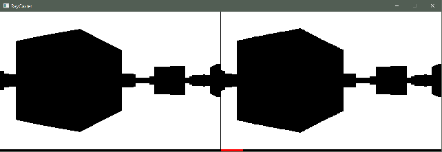

## RayCaster

Fast implementation of the raycasting algorithm for
resource-constraint architectures.

### Features

* fixed-point implementation (8-bit precision)
* no division operations
* 8 x 8-bit multiplications per vertical line
* precalculated trigonometric and perspective tables
* reference floating-point implementation for testing

### Screenshot

Reference (floating-point) raycaster on the left, optimized (fixed-point)
on the right (320x200 resolution).

### Goals

* run on Arduino Uno
* assembly-optimize for individual platforms

### Algorithm

See [this video](https://www.youtube.com/watch?v=eOCQfxRQ2pY) for basic overview
(thanks to Matt).

### Code

* [RayCasterFixed.cpp](RayCaster/RayCasterFixed.cpp) is the fast fixed-point implementation
* [RayCasterFloat.cpp](RayCaster/RayCasterFloat.cpp) is the reference floating-point implementation

Test program will render the view using SDL, use arrow keys to move around,
tested on Windows / Visual Studio 2017.
