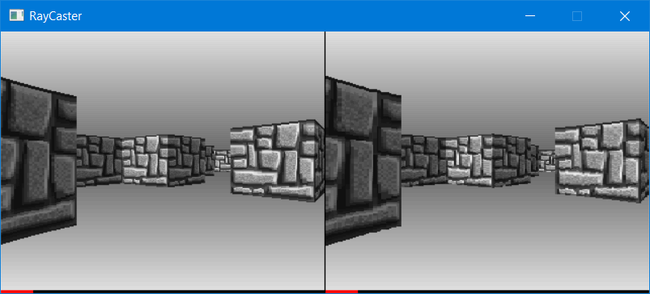
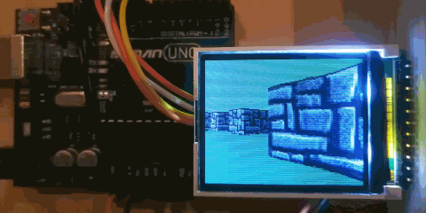

## RayCaster

Fast implementation of the raycasting algorithm for
resource-constrained architectures.

### Features

* fixed-point implementation (8-bit precision)
* no division operations
* 8 x 8-bit multiplications per vertical line
* precalculated trigonometric and perspective tables
* reference floating-point implementation for testing
* capable of running on an Arduino Uno

### Screenshot

##### Windows

Reference (floating-point) raycaster on the left, optimized (fixed-point)
on the right (320x256 resolution).

##### Arduino Uno

The algorithm runs at ~20fps on an Arduino Uno with
a connected ST7735R display (160x128). Here's a [video](https://youtu.be/kYEKC6_PQQw).

### To Do

* assembly-optimize

### Algorithm

See [this video](https://www.youtube.com/watch?v=eOCQfxRQ2pY) for basic overview
(thanks to Matt).

### Code

* [RayCasterFixed.cpp](RayCaster/RayCasterFixed.cpp) is the fast fixed-point implementation
* [RayCasterFloat.cpp](RayCaster/RayCasterFloat.cpp) is the reference floating-point implementation

For Windows, use the Visual Studio (x86) solution, it will render using SDL and
you can use arrow keys to move around.

For Arduino, use the Atmel Studio (AVR) solution and an Arduino Uno. You will need to wire up
an ST7735R TFT (160x128) per below:

* 5V -> VCC
* GND -> GND
* Pin 13 -> SCL
* Pin 11 -> SDA
* Pin 10 -> CS
* Pin 9 -> BS/DC
* Pin 8 -> RES

Thanks to Jukka Jylänki
for the [fast TFT library](https://github.com/juj/ST7735R).

You can also try runnning pre-built binaries from [Binaries](Binaries) directory
(.exe for Windows and .hex for AVRdude).
